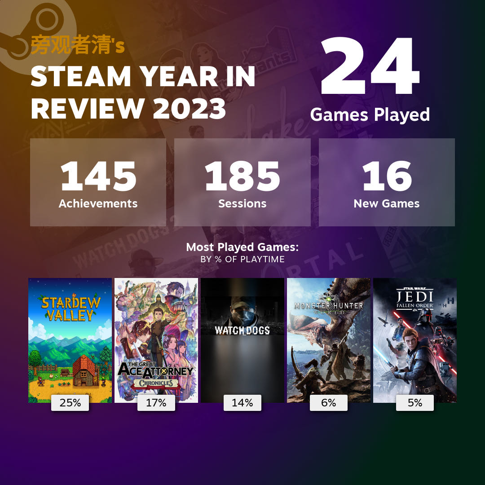
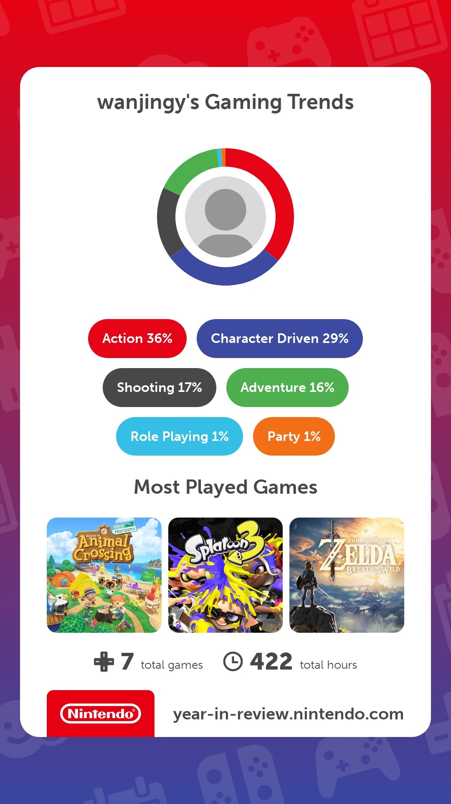

As a passionate gamer since my childhood, I've developed a profound interest in exploring diverse stories and achieving milestones within the gaming world. This enthusiasm has significantly influenced my journey into computer science and software engineering.

## Timeline
- *Back in the Day:* Started with tiny Flash games online and sneaking in some Nintendo 3DS time at my cousin's place.
- *University Years:* Got my game on with Steam when I got a laptop, though I longed for the handheld console experience, which was beyond my budget.
- *2023:* Fulfilling a dream, I finally acquired a Nintendo Switch, enriching my gaming experiences.

## 2023 Hightlights
- Steam library growing strong.

- Nintendo Switch joined the party.

Gaming isn't just downtime for me; it's a source of inspiration and problem-solving joy that fuels my computer science journey.