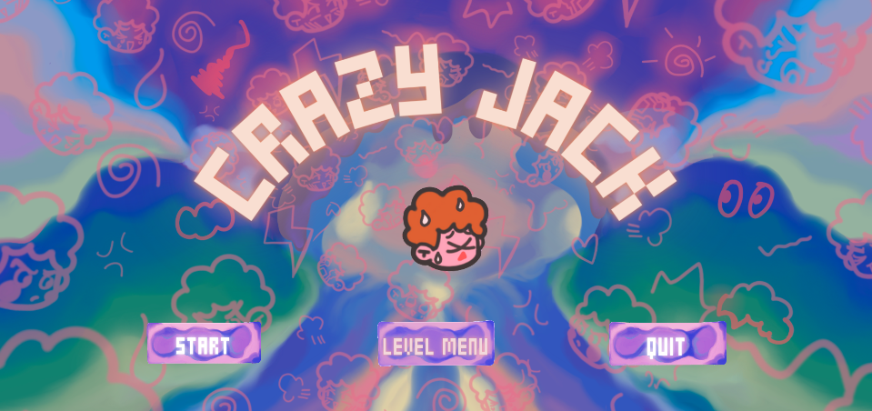

<pre>
Embark on an epic journey with our resilient protagonist, 
Jack, as he confronts a myriad of challenges. 
Armed with a dazzling array of imaginative drawing tools, 
Jack's creativity becomes his greatest asset on this thrilling adventure.
</pre>

Crazy Jack is a 2d platformer game with a drawing mechanism designed and developed by my team, Anxiety. My main role in this project is a gameplay programmer, implementing game mechanisms, designing and building game levels.

The player can use different types of drawing tools with different properties and costs to draw in order to reach the destination in each level. Each level has ink limitation, the player needs to use ink in a proper way. The player can self-decide how to use the combinations of different drawing tools to help them clear the level. 

Play our game on [Unity WebGL](https://zhengyuwu0924.github.io/CSCI526_GroupAnxiety_Project/Play/Final/)

## Key Features
- Drawing with different pens & brushes
  - Gravity brush: enables Player to change the gravity of an object
  - Magnet brush: enables Player to changes magnetism of an object
  - Wood pen: enables Player to draw light wooden object
  - Rock pen: enables Player to draw heavy and large object
  - Platform pen: enables Player to draw static platform
  - Eletronic pen: enables Player to draw cable between eletronic devices to power them
- Ink limitation
  - When the ink runs out, the player dies
  - Every pen & brush has its own ink consumption, Player needs to use different pens and brushes, make reasonable use of objects in the scene, save ink consumption, and pass the level
- Painting the shrine
  - By painting the shrine, the Player can change their properties. For example, if the Player paints the shrine with the gravity brush, their gravity will decrease, allowing them to jump higher.
- Star collection
  - There are three stars scattered in each level. Players can reach the destination without collecting them, but they can also spend more ink to collect them all.
- Combination of tools drawn by players themselves
  - E.g. Players can build a seesaw by combining wood pen and rock pen.

## Gameplay Video
<iframe width="80%" height="450px" class="mx-auto d-block" src="https://www.youtube.com/embed/LWYz-JTAXvM"></iframe>

Source: <a href="https://github.com/ZhengyuWu0924/CSCI526_GroupAnxiety_Project"><i class="large github icon "></i>GitHub</a>
