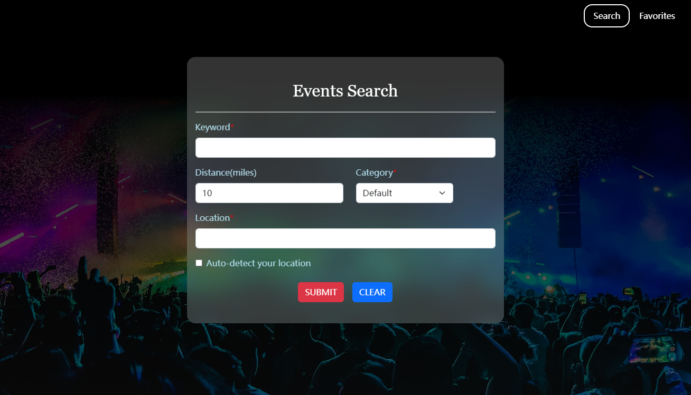
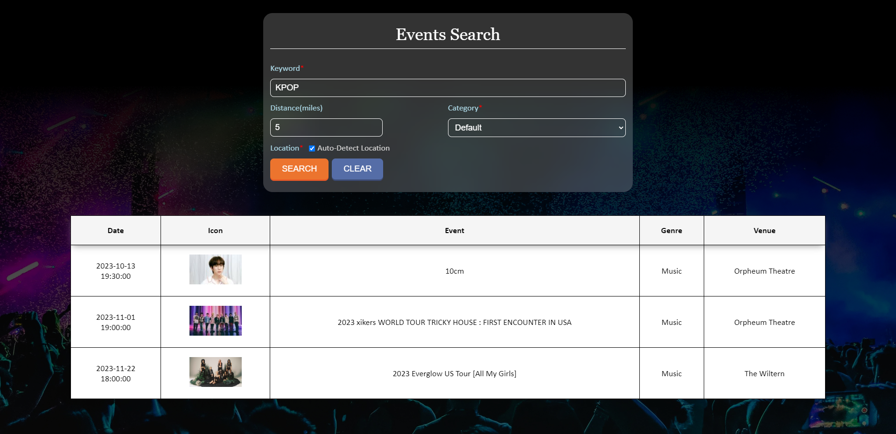
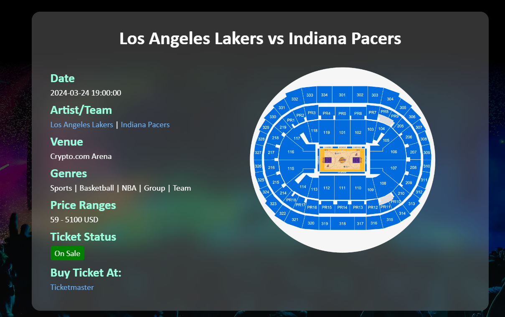
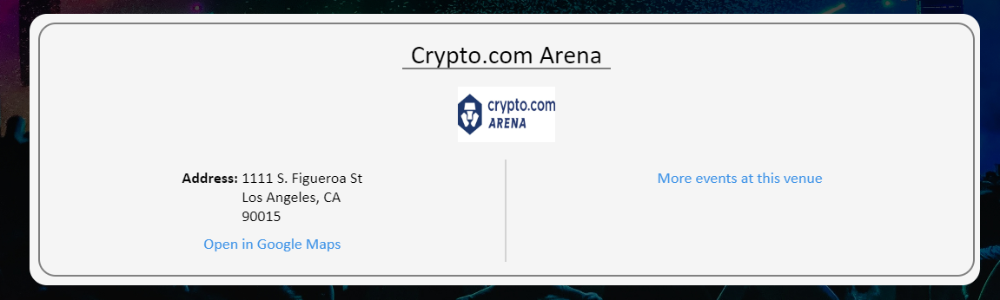
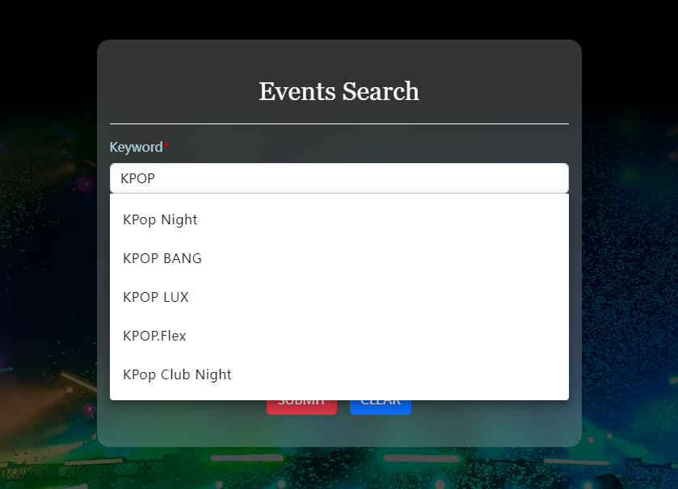
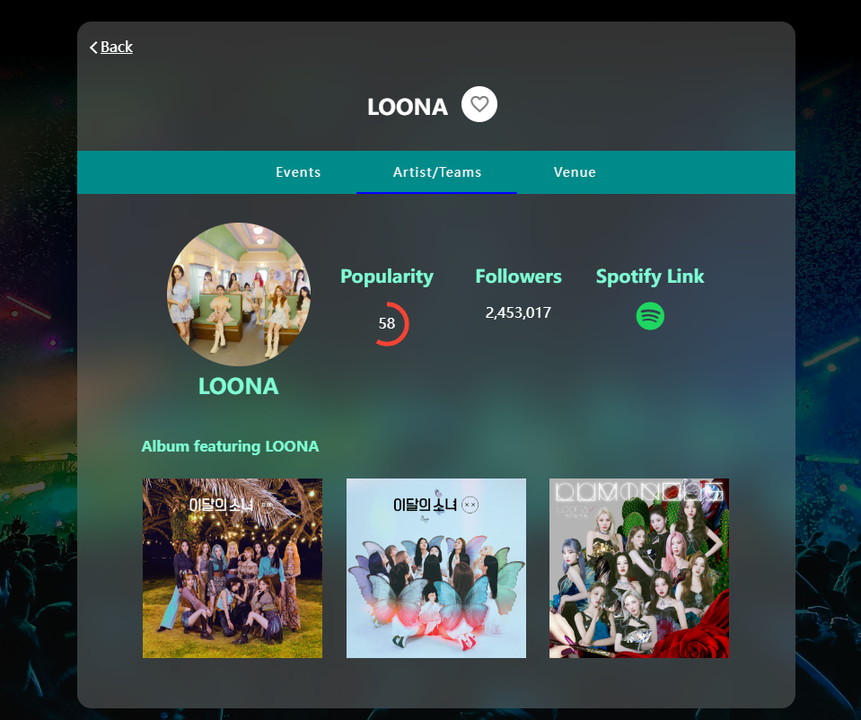
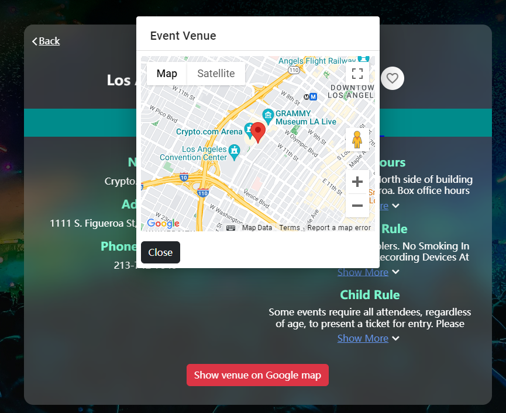
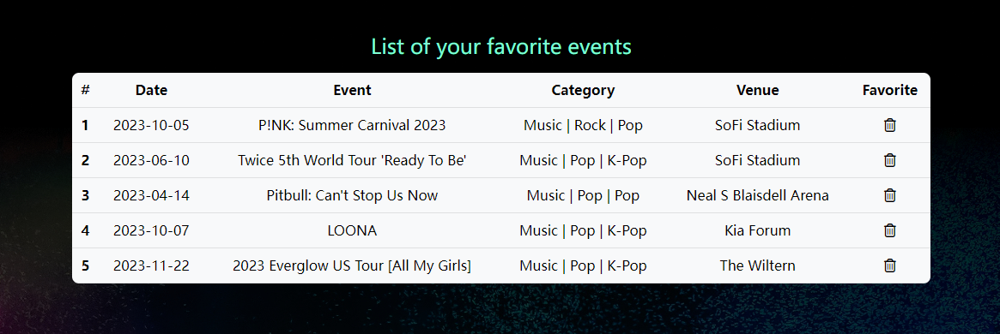
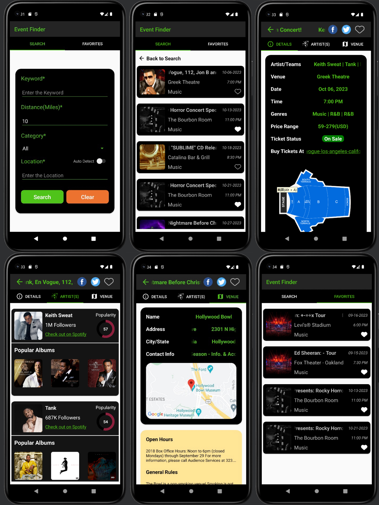

 
 

I developed and combined multiple full-stack projects focused on event search using various technologies and platforms. This includes two dynamic websites and a cutting-edge Android app: 
- [Event Search Website(JavaScript, Flask)](#event-search-website-1)
- [Event Search Website(Angular, Node.js)](#event-search-website-2)
- [Event Finder Android App](#event-finder-android-app)

 
 

## Event Search Website 1 [Visit Here](https://csci526-homework6.wl.r.appspot.com/)

### Techonologies: 
- Frontend: Javascript, HTML/CSS
- Backend: Flask

### Features: 
- Search events on TicketMaster based on keywords, distance, location and categories
- Auto-detect user's location
- Sort events by event names, categories or venues
- Provide details of specific event and corresponding venue

### Screenshots:

  
  
  

 
 

## Event Search Website 2 [Visit Here](https://event-search-ywj.wl.r.appspot.com)

### Techonologies: 
- Frontend: Angular, Typescript, Bootstrap
- Backend: Node.js, Express

### Features Added: 
- Auto-complete keywords input by users
- Provide more details of specific event and corresponding venue, such as venue location on Google Map
- Provide artists' Spotify profile of music-related events
- Mark favorite events in website Cookies

### Screenshots:

  
  
  
  

 
 

## Event Finder Android App

I developed an Android app on Android Studio with all the features mentioned above. Reused the Node.js backend I constructed for [Event Search Website 2](#event-search-website-2) to fetch data from APIs.

### Screenshots:

 
 

Source: <a href="https://gitfront.io/r/user-4509220/iD4QEsaTmcKq/wanjingy.github.io/"><i class="large github icon "></i>Github</a>
