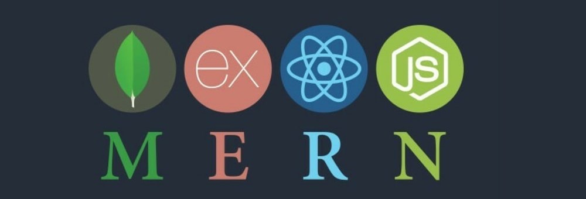

 
 

During the summer of 2023, I completed the [Front End Development Libraries](https://www.freecodecamp.org/learn/front-end-development-libraries/) and [Back End Development and APIs](https://www.freecodecamp.org/learn/back-end-development-and-apis/) certifications on freeCodeCamp. These certifications have provided me with a solid understanding of the MERN (MongoDB, Express.js, React, Node.js) stack. As part of these courses, I had the opportunity to work on various projects to apply and reinforce my learning.

 
 

## Front End Projects

- Random Quote Machine
<iframe height="300" style="width: 100%;" scrolling="no" title="Random Quote Machine" src="https://codepen.io/Wanjing-Yang/embed/vYQmXxm?default-tab=js%2Cresult" frameborder="no" loading="lazy" allowtransparency="true" allowfullscreen="true">
  See the Pen <a href="https://codepen.io/Wanjing-Yang/pen/vYQmXxm">
  Random Quote Machine</a> by Wanjing Yang (<a href="https://codepen.io/Wanjing-Yang">@Wanjing-Yang</a>)
  on <a href="https://codepen.io">CodePen</a>.
</iframe>
- 25 + 5 Clock
<iframe height="300" style="width: 100%;" scrolling="no" title="25+5 Clock" src="https://codepen.io/Wanjing-Yang/embed/WNYWVqq?default-tab=js%2Cresult" frameborder="no" loading="lazy" allowtransparency="true" allowfullscreen="true">
  See the Pen <a href="https://codepen.io/Wanjing-Yang/pen/WNYWVqq">
  25+5 Clock</a> by Wanjing Yang (<a href="https://codepen.io/Wanjing-Yang">@Wanjing-Yang</a>)
  on <a href="https://codepen.io">CodePen</a>.
</iframe>