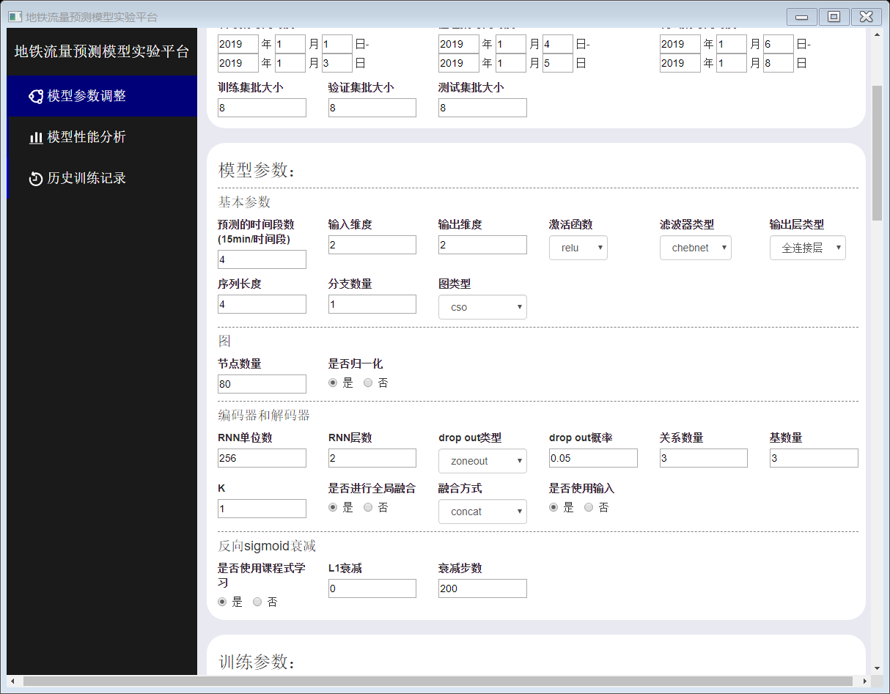
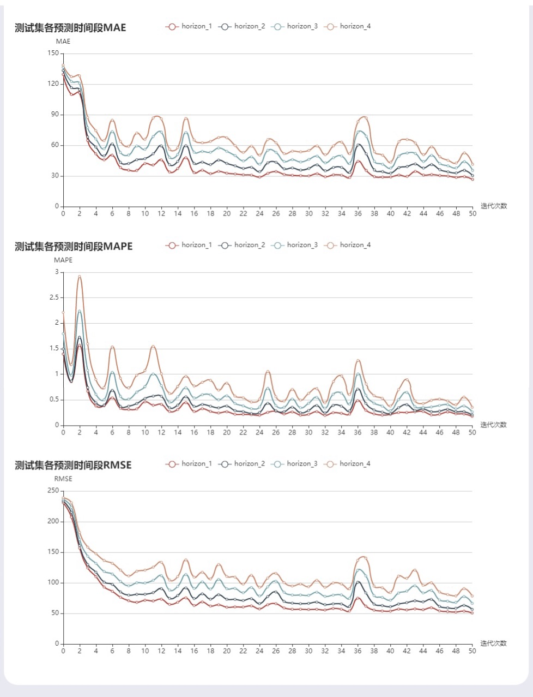
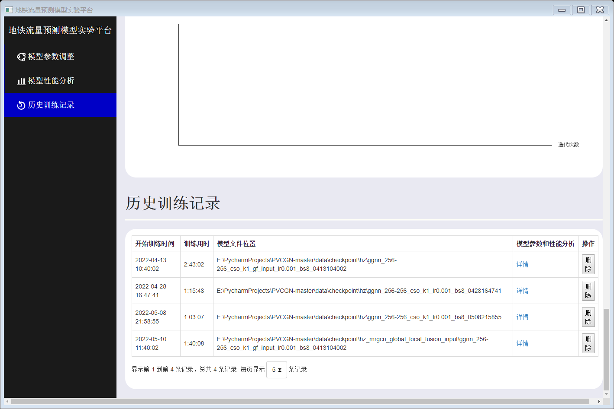

The metro ridership prediction system is designed on the basis of a spatial-temporal metro ridership prediction model, which is beneficial to the construction of intelligent transportation system. In the development of the city, traffic management is an indispensable part. What’s more, the flow management of the metro system is closely related to the daily life of citizens. This system, in turn, streamlines the training process for the metro ridership prediction model within the management department.

In the project, I read a lot of survey about metro ridership prediction and multivariate time series prediction and decided to choose a graph neural network named "Physical-Virtual Collaboration Graph Network"(referenced in [this paper](https://ieeexplore.ieee.org/abstract/document/9269513)) to be the core of my system. Further, I designed and developed a GUI for the training of the model. I utilized HTML/CSS and JavaScript to created a user-friendly UI and embedded it into a Python application with the use of PyQt, ensuring a cohesive and efficient user interface for model training.

## Features:
- Adjust model parameters
- Model training moniter
- Analysis of model performance
- Model training history

## Screenshots:

  
  
A part of model parameters adjustment

  
  
A part of model performance analysis

  
  
Manage model training history

