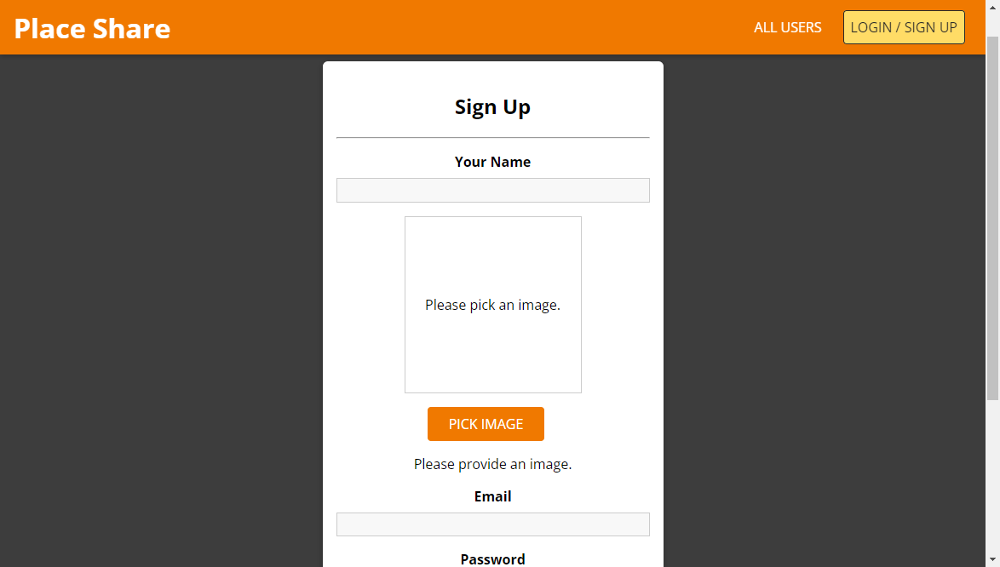

I developed a places sharing platform with the use of MERN where users are able to post places, intergrating AWS S3 to implement persistent image storage. Visite the websit: [Place Share](https://placeshare-93b6f.web.app/).

## Techonologies:
- Frontend
    - React
    - Deployed on [Render](https://render.com/)

- Backend
    - Node.js
    - Express.js
    - MongoDB
    - AWS S3
    - Deployed on [Firebase](https://firebase.google.com/)

## Features:
- Intuitive exploration of places posted by others.

- Interactive view of places on Google Maps for enhanced user experience.

- Sharing, editing, and deletion of places for users.

- User authentication with signup and login capabilities.

  
  

 
 

Source: <a href="https://github.com/ywj128/PlaceShare"><i class="large github icon "></i>Github</a>